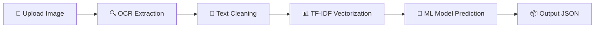

# 🍎 AI Food Ingredient Analyzer

<p align="center">
  
  
  
  
</p>

<p align="center">
  🚀 <b>Upload food ingredient image → Get health insights instantly</b>
</p>

---

## 🌐 Live Demo

👉 **Try here:**
🔗 https://ml-college-project-1.onrender.com

---

## ✨ Features

* 📸 Upload food ingredient image
* 🔍 OCR extracts text automatically
* 🧠 ML model predicts **NutriScore (A–E)**
* ⚠️ Detects **risk ingredients** (sugar, sodium, etc.)
* 🧬 Identifies **allergens**
* ❤️ Personalized advice (diabetes, lactose intolerance, etc.)
* 📊 Usage recommendation (daily / avoid / limit)

---

## 🧠 How It Works



---

## 🛠️ Tech Stack

* ⚙️ Flask (Backend API)
* 🧠 Scikit-learn (ML Model)
* 📊 TF-IDF Vectorizer
* 🔍 OCR.space API (Image → Text)
* 🐍 Python

---

## 📦 API Usage

### 🔗 Endpoint

```
POST /analyze
```

---

### 📤 Request (Postman / Frontend)

* Body → **form-data**

| Key               | Type            |
| ----------------- | --------------- |
| image             | File            |
| health_conditions | Text (optional) |

---

### 📥 Sample Response

```json
{
  "analysis": {
    "grade": "C",
    "confidence": 0.82,
    "health_impact": "Moderate impact"
  },
  "risks": {
    "risk_words": ["sugar", "sodium"],
    "severity": "medium"
  },
  "allergens": {
    "detected": []
  },
  "usage": {
    "daily_recommendation": "Limit (2-3/week)"
  },
  "personalized": {
    "conditions": ["diabetes"],
    "advice": ["Avoid high sugar due to diabetes"]
  },
  "recommendations": [
    "Choose low-sugar alternatives"
  ]
}
```

---

## 🚀 Installation (Local Setup)

```bash
git clone https://github.com/your-username/your-repo.git
cd your-repo
pip install -r requirements.txt
```

---

### ▶️ Run Server

```bash
python app.py
```

---

## 🔐 Environment Variables

Create `.env` file:

```
OCR_API_KEY=your_api_key_here
```

---

## 📸 Example Use Case

* Scan biscuit packet 🍪
* Detect sugar, oil, preservatives ⚠️
* Get health recommendation instantly

---

## 📊 Future Improvements

* 🌍 Multi-language OCR
* 📱 Mobile app (React Native)
* 🤖 Deep learning model upgrade
* 🧾 Nutrition + ingredient hybrid analysis

---

## 👨‍💻 Author

**Atharva Thak**
🎓 BTech Student | AI & Web Developer

---

## ⭐ Support

If you like this project:

👉 ⭐ Star the repo
👉 🍴 Fork it
👉 💡 Contribute

---

<p align="center">
  🚀 Built with passion for AI + Health Tech
</p>
